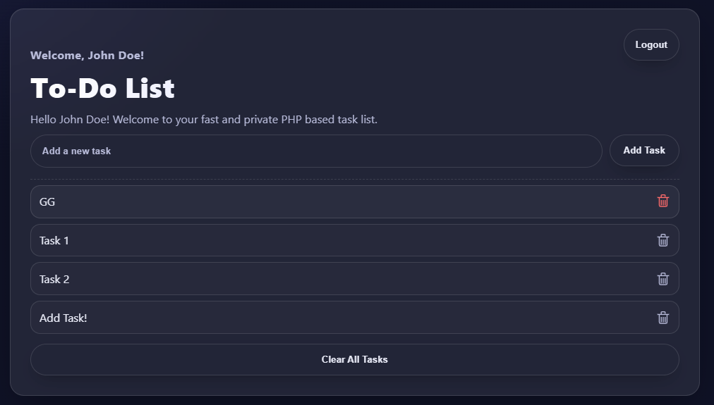
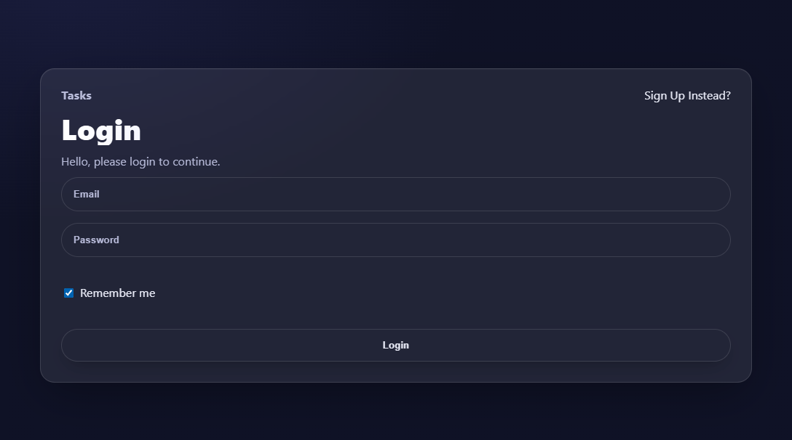
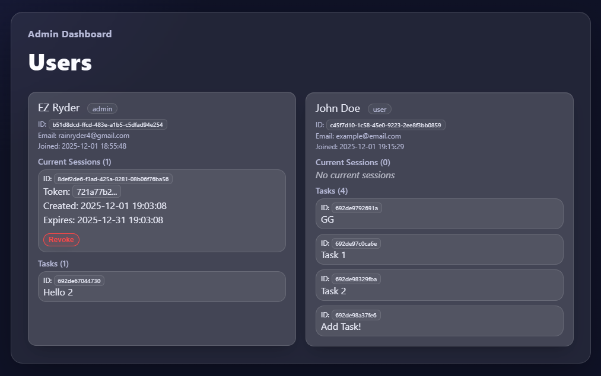

# Tasks Application

[](https://tasks.redsunsetfarm.com)

A simple task management application built with PHP (custom MVC framework), MySQL, and Docker. This application allows users to register, manage tasks, and features real-time-like updates via short polling.



## Features

- **User Authentication**:
  - Register and Login.
  - Session management with "Remember Me" functionality.
  - Secure password hashing (Bcrypt).
  - CSRF Protection for state-changing requests.
  
  

- **Task Management**:
  - Create, Read, Update, and Delete (CRUD) tasks.
  - Tasks are private to each user.
  - **Short Polling**: The frontend periodically checks for updates to keep the task list in sync across multiple tabs/devices.
- **Admin Dashboard**:
  - View all sessions, tasks, and users.
  - View details of specific users.
  
  

- **Architecture**:
  - Custom MVC structure.
  - Middleware-based authentication.
  - PDO for database interactions.

## Tech Stack

- **Backend**: PHP 8.2
- **Database**: MySQL
- **Server**: Apache (via Docker image)
- **Frontend**: HTML, CSS, JavaScript (Vanilla)
- **Infrastructure**: Docker, Docker Compose
- **Dependency Management**: Composer

## Prerequisites

- Docker and Docker Compose installed on your machine.

## Setup Instructions

1.  **Clone the repository**:

    ```bash
    git clone <repository_url>
    cd <repository_folder>
    ```

2.  **Environment Configuration**:
    Create a `.env` file in the root directory. You can use the following example configuration:

    ```env
    DB_HOST=db
    MYSQL_DATABASE=tasks_db
    MYSQL_USER=user
    MYSQL_PASSWORD=password
    MYSQL_ROOT_PASSWORD=root_password
    ```

3.  **Start the Application**:
    Run the following command to build and start the containers:

    ```bash
    docker-compose up -d --build
    ```

    This command will:

    - Start the MySQL database container.
    - Build the PHP/Apache container.
    - Install PHP dependencies via Composer.
    - Initialize the database tables automatically on the first run (logic in `src/config/db_config.php`).

4.  **Access the Application**:
    Open your browser and navigate to:
    ```
    http://localhost:8081
    ```

## Docker Management

### Restarting Containers

To restart the application containers (e.g., after a configuration change):

```bash
docker-compose restart
```

### Restarting without Database Disruption

To rebuild or restart the web application container without stopping the database (preserving the database state and uptime):

1.  Restart only the PHP/Apache container:

    ```bash
    docker-compose restart task-app-environment
    ```

2.  If you need to rebuild the image (e.g., after changing the Dockerfile):
    ```bash
    docker-compose up -d --no-deps --build task-app-environment
    ```
    - `--no-deps`: Don't restart linked services (like the database).
    - `--build`: Rebuild the image before starting.

### Resetting the Database

To completely **wipe the database** and start fresh (e.g., to re-register the admin account):

1.  Bring down the containers and remove the data volume:
    ```bash
    docker-compose down -v
    ```

2.  Start the application again:
    ```bash
    docker-compose up -d
    ```

> **Note**: The database data is currently stored in the `db_data` volume. Running `docker-compose down -v` will destroy this volume and **wipe all data**.

## Project Structure

```
├── public/                 # Publicly accessible files (Web Root)
│   ├── assets/             # CSS, JS, Images
│   └── index.php           # Entry point
├── src/                    # Source code
│   ├── config/             # Configuration (Database connection)
│   ├── Controllers/        # Request handlers (Auth, Tasks, Admin, Views)
│   ├── Helpers/            # Utilities (CSRF, Assets)
│   ├── Middleware/         # Request middleware (Authentication)
│   ├── Models/             # Database interactions (Users, Tasks, Sessions)
│   ├── Views/              # HTML Templates
│   └── Router.php          # Routing logic
├── docker-compose.yml      # Docker Compose service definitions
├── Dockerfile              # PHP/Apache Docker image definition
└── composer.json           # PHP Dependencies
```

## API Endpoints

The application exposes several API endpoints for frontend interaction:

### Auth

- `POST /api/auth/register`: Register a new user.
- `POST /api/auth/login`: Login.
- `POST /api/auth/logout`: Logout.

### Tasks

- `GET /api/tasks`: Get all tasks for the logged-in user.
- `DELETE /api/tasks`: Clear all tasks for the logged-in user.
- `POST /api/tasks`: Create a new task (requires `task` field).
- `POST /api/tasks` (with `edit_task_id`): Update a task.
- `POST /api/tasks` (with `delete_task_id`): Delete a task.
- `GET /api/tasks?count=<n>`: Poll for task updates (Short Polling).

### Users

- `GET /api/users/current`: Get current logged-in user info.

### Admin (Protected)

- `GET /api/admin/all-sessions`: List all active sessions.
- `GET /api/admin/all-tasks`: List all tasks in the system.
- `GET /api/admin/all-users`: List all registered users.
- `GET /api/admin/users/current`: Get user details by ID (extracted from URL, typically for `current` user in context of admin view logic).

## Development

- **Database Initialization**: The database tables (`users`, `tasks`, `sessions`) are automatically created if they don't exist when the application starts (defined in `src/config/db_config.php`).
- **Admin Access**: To access admin features, register a user with the email `rainryder4@gmail.com`.
